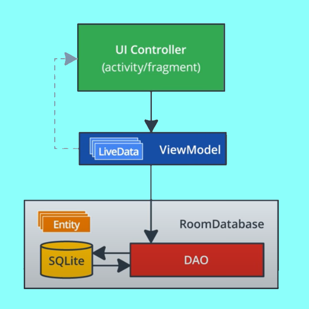

# SleepRating
**SleepRating** is a toy App that helps you collect information about your sleep.

It also allows you to set up a notification alarm, just to remind you to rate your sleep period.

*This app demonstrates the following views and libraries:*

* Room database
* DAO
* Coroutines

*It also uses and builds on the following techniques:*

* Transformation map
* Data Binding in XML files
* ViewModel Factory
* Using Backing Properties to protect MutableLiveData
* Observable state LiveData variables to trigger navigation

