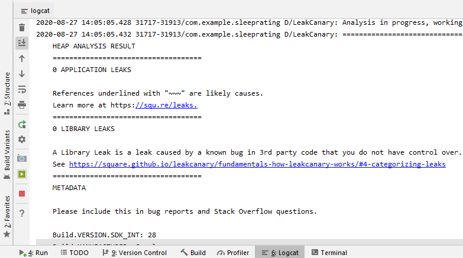

# Sleep Rating
**Sleep Rating** is an Android App that helps you collect information about your sleep.

It stores every sleep duration in a local dataBase; then this records can be observed and analysed in the chart📊 section.

As a user, you have the option to set up a notification alarm; just to remind you to rate your sleep💤 period.

Here is a short video presentation.

*This app demonstrates the following views and libraries:*

* Room database
* DAO
* Coroutines
* MPAndroidChart
* LeakCanary

*It also uses and builds on the following techniques:*

* Transformation map
* Data Binding in XML files
* ViewModel Factory
* Using Backing Properties to protect MutableLiveData
* Observable state LiveData variables to trigger navigation

Thanks to LeakCanary’s knowledge of the internals of the Android Framework, **Sleep Rating** has been tested for memory leaks:

